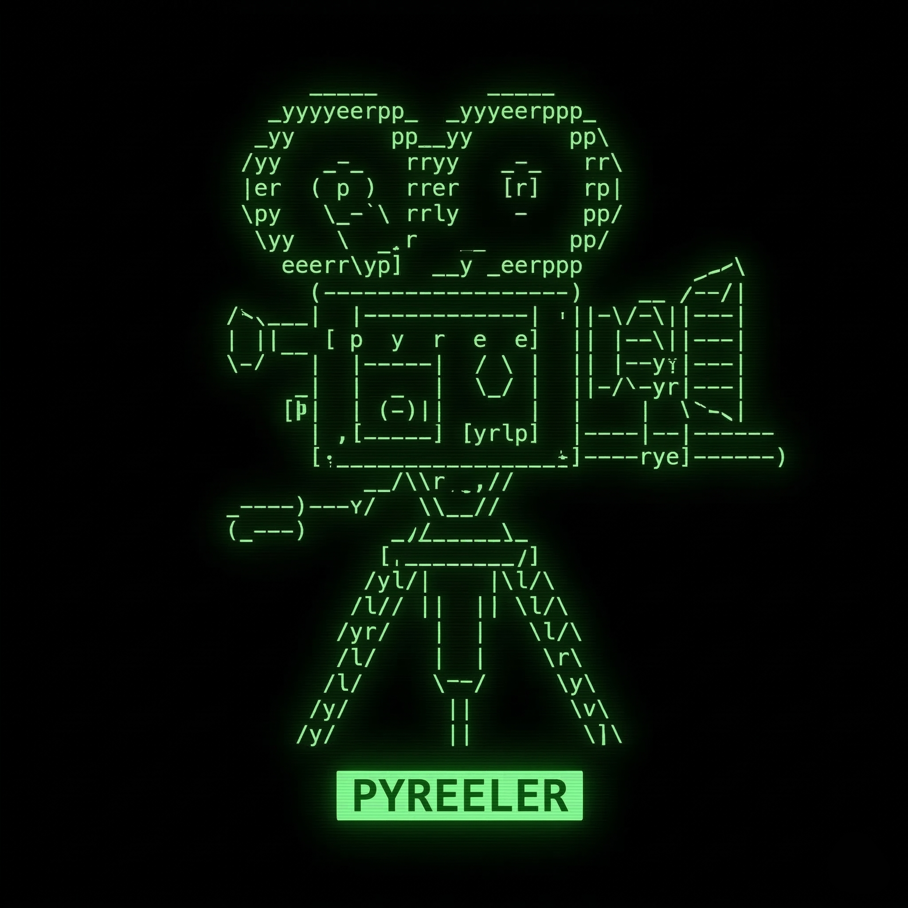

# PyReeler

PyReeler is a portable skill for designing and delivering short code-generated films, loops, and experimental motion pieces. Available for both **OpenAI Codex** and **Claude Code**.

It is intentionally skill-first rather than framework-first. The portable package stays lightweight, readable, and dependable across common modern hardware.

It is built around a simple rule set:
- Make a full-duration preview first
- Keep previews cheap by lowering fidelity before lowering runtime
- Judge the piece on arc, motif development, pacing, and landing
- Only upscale after preview approval

## Available Versions

| Version | Location | Invoke With |
|---------|----------|-------------|
| **OpenAI Codex** | `skills/codex/` | `$pyreeler` |
| **Claude Code** | `skills/claude/` | `/pyreeler` |

Both versions share the same core philosophy and workflow, adapted for each AI's capabilities.

## Quick Start

### For Codex Users
```text
Use $pyreeler to make a 45 second code-generated ritual film that begins calm, becomes entrancing, and ends with a single rupture.
```

### For Claude Users
```text
/pyreeler make a 45 second code-generated ritual film that begins calm, becomes entrancing, and ends with a single rupture.
```

## Featured Films

[**View the Showcase Gallery on GitHub Pages**](https://boxwrench.github.io/pyreeler/)

Completed films with full source code (run scripts to generate videos):
- `films/interference/` — geometric moiré patterns, 60s
- `films/sentient-weather/` — emotional particle systems, 60s
- `films/what-the-light-kept/` — AI memory fragment narrative, 45s
- `films/dungeon-emergence/` — ASCII dungeon emergence, 45s

**Note:** Video files are generated locally and not stored in this repository due to file size limits.

## Repository Structure

```
pyreeler/
├── skills/                  # AI assistant skills
│   ├── claude/              # Claude Code skill
│   └── codex/               # OpenAI Codex skill
│
├── films/                   # Complete film projects
│   ├── interference/
│   ├── sentient-weather/
│   ├── what-the-light-kept/
│   └── dungeon-emergence/
│
├── research/                # Effects catalogs, audio timelines, notes
│
├── templates/               # Shared audio/video starter modules
│   ├── audio/               # sfx_gen.py, composer.py, audio_engine.py, voice.py
│   └── video/               # ffmpeg_utils.py, render_runtime.py, parallel_render.py
│
├── docs/
│   ├── specs/               # Design specifications
│   ├── plans/               # Implementation plans
│   └── benchmarks/          # Performance benchmarks
│
├── assets/                  # Logo and static media
└── DEVLOG.md                # Development history
```

## Using This Skill With Other AI Models

The PyReeler skill is documented in human-readable Markdown and YAML files. Other AI models can:

- **Read and adapt** the skill files (`skills/*/SKILL.md`, `templates/`, `research/`) for their own skill systems
- **Implement as a prompt** by reading the workflow guidance and creative references directly into context

The skill is intentionally code-first and framework-agnostic. The core principles (preview-first, hardware-aware rendering, stem-based audio) can be applied regardless of the AI platform.

## Core Principles

### Audio Direction
PyReeler treats audio as a first-class part of the film structure:
- **Default**: procedural foley and ambience
- **Optional music**: compact SoundFont workflow
- **Optional voice**: `edge-tts`
- **Structure**: `ambience`, `pulse`, `impacts`, `score`, and `voice` as separate conceptual stems

### Template Layer
The `templates/` folder provides lightweight starters, not a full framework:
- `sfx_gen.py`: procedural ambience, impacts, and shimmer
- `composer.py`: motif-to-MIDI helpers and optional SoundFont rendering path
- `voice.py`: optional `edge-tts` helper
- `audio_engine.py`: simple stem placement, ducking, mastering, and WAV export
- `ffmpeg_utils.py`: host-profile detection, encoder smoke tests, and conservative worker heuristics
- `render_runtime.py`: one-call portable render defaults for encoder, ffmpeg path, and worker count
- `parallel_render.py`: multiprocess frame rendering with ordered output (Claude version)

### Dependency Approach
PyReeler uses a tiered dependency model:
- **Core path**: `ffmpeg`, `numpy`, and standard Python
- **Recommended audio**: add `scipy` when filtering materially improves the result
- **Optional score**: add `midiutil` and `fluidsynth`/`pyfluidsynth`, plus a small SoundFont
- **Optional voice**: add `edge-tts` only when needed

### Workflow Notes
- **Preview**: full-duration piece for artistic review
- **Test pass**: technical/debugging render (not shown as preview)
- Always make a preview version first
- Never present a partial-duration render as the preview
- Surface the preview to the user before committing to an upscale
- Export approved finals to `~/Videos`

## Installing

**Tested on Windows and Ubuntu Linux.**
**macOS support is expected** (the code handles Apple Silicon and `h264_videotoolbox`) but has not been personally verified.

### Prerequisites

**macOS** (untested):
```bash
brew install ffmpeg
# Optional: brew install fluidsynth
```

**Linux** (Ubuntu tested):
```bash
sudo apt-get install ffmpeg
# Optional: sudo apt-get install fluidsynth
```

**Windows** (tested):
- Install [FFmpeg](https://ffmpeg.org/download.html) and add to PATH
- Optional: Install [FluidSynth](https://github.com/FluidSynth/fluidsynth/releases)

### Codex
Copy or symlink `skills/codex/` to your Codex skills directory:
- **macOS/Linux**: `~/.codex/skills/`
- **Windows**: `%USERPROFILE%\.codex\skills\`

### Claude Code
Copy or symlink `skills/claude/` to your Claude Code skills directory:
- **macOS/Linux**: `~/.claude/skills/`
- **Windows**: `%APPDATA%\Claude\skills\`

See the individual skill folders for detailed installation instructions.

## License

MIT License. See [LICENSE](LICENSE).

If you adapt or redistribute PyReeler, please preserve the original copyright and license notice.
