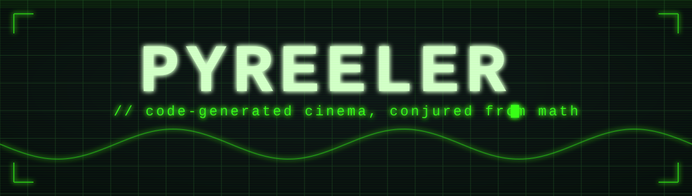
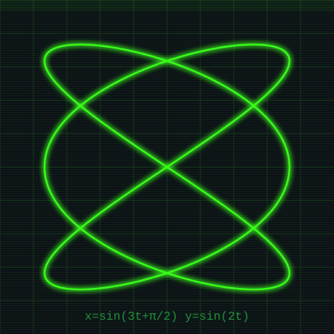
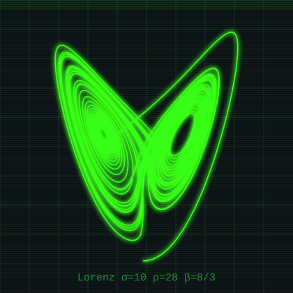

<div align="center">
  
</div>

# PyReeler

> *Give an AI a render farm and it makes a music video. Give it a few hundred lines of NumPy and a sense of restraint, and it makes a **film**.*

**PyReeler turns an AI assistant into a director of short, code-generated cinema** — loops, rituals, glitch-poems, and experimental motion pieces conjured entirely from math, pixels, and procedural sound. No model weights. No stock footage. No "prompt and pray." Just code that knows how to *pace itself*.

It runs as a portable skill for both **OpenAI Codex** and **Claude Code**. Skill-first, not framework-first: the whole package stays lightweight, readable, and stubborn about working on the hardware you already own.

### The House Rules

PyReeler believes a film is an *arc*, not a wallpaper. So it follows a small creed:

- 🎬 **Preview the whole thing first** — full duration, every time. A great 5 seconds is not a film.
- 🪶 **Cheap previews, fast iterations** — drop fidelity before you drop runtime. See the shape, then make it pretty.
- 🎭 **Judge it like a critic** — arc, motif, pacing, and *the landing*. Does it end, or does it just stop?
- ✨ **Only upscale what earns it** — pixels are a reward for a piece that already works.

<div align="center"></div>

## The Beauty of Math, Rendered

PyReeler's whole thesis fits in two pictures. A few equations, integrated frame by frame, become something you'd hang on a wall. *(Both of these were drawn by `assets/readme/generate_readme_art.py` — the README art is code-generated too, naturally.)*

<div align="center">
  <table>
    <tr>
      <td align="center"></td>
      <td align="center"></td>
    </tr>
    <tr>
      <td align="center"><em>A Lissajous figure — two sine waves at right angles, dancing.</em></td>
      <td align="center"><em>The Lorenz attractor — chaos that never repeats, yet never escapes.</em></td>
    </tr>
  </table>
</div>

This is the feeling PyReeler chases: not "render a thing," but *make the math perform.*

<div align="center"></div>

## Available Versions

| Version | Location | Invoke With |
|---------|----------|-------------|
| **OpenAI Codex** | `skills/codex/` | `$pyreeler` |
| **Claude Code** | `skills/claude/` | `/pyreeler` |

Both versions share the same soul and workflow, adapted to each AI's quirks.

## Quick Start

Talk to it like a director talks to a cinematographer — give it a feeling and an arc, not a parameter dump.

### For Codex Users
```text
Use $pyreeler to make a 45 second code-generated ritual film that begins calm, becomes entrancing, and ends with a single rupture.
```

### For Claude Users
```text
/pyreeler make a 45 second code-generated ritual film that begins calm, becomes entrancing, and ends with a single rupture.
```

Then watch it sweat the pacing for you.

<div align="center"></div>

## Use It Without an AI (CLI)

PyReeler also ships a deterministic command-line renderer — no AI, no API cost,
fully offline. Pick a recipe, turn the knobs, render:

```bash
python3 -m pyreeler list                                   # see available recipes
python3 -m pyreeler render lorenz --duration 30 -o butterfly.mp4
python3 -m pyreeler render rossler --c 5.7 --palette amber -o scroll.mp4
```

Every recipe exposes typed, range-checked flags (`--rho`, `--fps`, `--palette`, …) —
run `python3 -m pyreeler render <recipe> -h` to see them. Core deps are just
`numpy` + `pillow` + FFmpeg. An interactive TUI front-end (phosphor banner and all)
is on the way.

## Featured Films

[**🎞️ Step into the Showcase Gallery →**](https://boxwrench.github.io/pyreeler/)

Every frame below was born from a script you can read, run, and remix:

- `films/interference/` — *geometric moiré, breathing in and out of resonance.* 60s
- `films/sentient-weather/` — *particle systems that seem to have moods.* 60s
- `films/what-the-light-kept/` — *an AI sifting its own memory fragments.* 45s
- `films/dungeon-emergence/` — *a world assembling itself out of ASCII.* 45s

**Note:** A small set of low-bitrate showcase clips is committed under `assets/showcase/` to power the gallery above. Full-resolution finals and preview renders are *not* tracked — `.gitignore` excludes `*.mp4`/`*.mov`/`*.avi` by default, so generate those locally and export approved finals to `~/Videos`.

## Repository Structure

```
pyreeler/
├── skills/                  # AI assistant skills
│   ├── _shared/             # Canonical shared reference docs used by sync.py
│   ├── claude/              # Claude Code skill
│   └── codex/               # OpenAI Codex skill
│
├── films/                   # Complete film projects
│   ├── interference/
│   ├── sentient-weather/
│   ├── what-the-light-kept/
│   └── dungeon-emergence/
│
├── research/                # [Research Index](research/INDEX.md) — Effects, timelines, inspiration
│
├── templates/               # Shared audio/video starter modules
│   ├── audio/               # sfx_gen.py, composer.py, audio_engine.py, voice.py
│   └── video/               # ffmpeg_utils.py, render_runtime.py, parallel_render.py
│
├── docs/
│   ├── specs/               # Design specifications
│   ├── plans/               # Implementation plans
│   └── benchmarks/          # Performance benchmarks
│
├── assets/                  # Logo and static media
├── tests/                   # Test suite (run with `pytest`)
├── sync.py                  # Distributes canonical templates into the skill folders
└── DEVLOG.md                # Development history
```

## Development

`templates/` (repo root) is the single source of truth for template code.
`skills/_shared/references/` is the source for reference docs that are
byte-identical across providers. Each skill must ship self-contained, so these
files are physical copies in `skills/claude/` and `skills/codex/`. After editing
either source tree, redistribute the copies:

```bash
python3 sync.py          # copy canonical files into skills/claude and skills/codex
python3 sync.py --check  # verify nothing has drifted (used in CI)
python3 graduation_check.py  # verify graduated templates are declared/tested/proven
python3 -m pytest -q     # run the test suite
```

A graduated template is a portable helper whose canonical source lives in
`templates/`, is declared in `template_graduation.toml`, is distributed into both
skill folders by `sync.py`, has at least one test path, and has at least one
example film/demo or documented usage path.

## Using This Skill With Other AI Models

The PyReeler skill is documented in human-readable Markdown and YAML files. Other AI models can:

- **Read and adapt** the skill files (`skills/*/SKILL.md`, `templates/`, `research/`) for their own skill systems
- **Implement as a prompt** by reading the workflow guidance and creative references directly into context

The skill is intentionally code-first and framework-agnostic. The core principles (preview-first, hardware-aware rendering, stem-based audio) can be applied regardless of the AI platform.

## Core Principles

### Audio Direction
PyReeler treats audio as a first-class part of the film structure:
- **Default**: procedural foley and ambience
- **Optional music**: compact SoundFont workflow
- **Optional voice**: `edge-tts`
- **Structure**: `ambience`, `pulse`, `impacts`, `score`, and `voice` as separate conceptual stems

### Template Layer
The `templates/` folder provides lightweight starters, not a full framework:
- `sfx_gen.py`: procedural ambience, impacts, and shimmer
- `composer.py`: motif-to-MIDI helpers and optional SoundFont rendering path
- `voice.py`: optional `edge-tts` helper
- `audio_engine.py`: simple stem placement, ducking, mastering, and WAV export
- `audio_reactive.py`: per-frame RMS envelopes for audio-driven visual parameters
- `ffmpeg_utils.py`: host-profile detection, encoder smoke tests, and conservative worker heuristics
- `render_runtime.py`: one-call portable render defaults for encoder, ffmpeg path, and worker count
- `parallel_render.py`: multiprocess frame rendering with ordered output (Claude version)

### Dependency Approach
PyReeler uses a tiered dependency model:
- **Core path**: `ffmpeg`, `numpy`, and standard Python
- **Recommended audio**: add `scipy` when filtering materially improves the result
- **Optional score**: add `midiutil` and `fluidsynth`/`pyfluidsynth`, plus a small SoundFont
- **Optional voice**: add `edge-tts` only when needed

### Workflow Notes
- **Preview**: full-duration piece for artistic review
- **Test pass**: technical/debugging render (not shown as preview)
- Always make a preview version first
- Never present a partial-duration render as the preview
- Surface the preview to the user before committing to an upscale
- Export approved finals to `~/Videos`

### War Stories: Things That Bit Us So They Won't Bite You

Every number in these tables was paid for in render time and disk space. The **Interference** film — all those gorgeous moiré patterns — once weighed **273MB for 60 seconds at 720p**. That's 10× heavier than it had any right to be. Here's what we learned dragging it back down to earth.

#### Content That Bloats File Size
| Content Type | Why It Bloats | Mitigation |
|--------------|----------------|------------|
| **Fine line patterns** (grids, moiré) | High-frequency noise, hard to compress | CRF 28, add slight blur/glow, lower resolution |
| **Film grain / noise** | Random data, no temporal redundancy | Use consistent seed, reduce noise amplitude |
| **Fast motion** | Less frame-to-frame similarity | Lower FPS (18-24), motion blur |
| **High contrast edges** | Sharp transitions | Slight anti-aliasing, glow effects |
| **Alpha channels** | Extra data per pixel | Pre-composite, don't render transparency |
| **Lossless codecs** | No compression | Use H.264 with CRF 23-28 |

#### Render Time Killers
| Issue | Why It Slows Down | Fix |
|-------|-------------------|-----|
| **Sequential frame rendering** | 1 CPU core only | Use `parallel_render.py` with `runtime.workers` |
| **Canvas larger than output** | Drawing pixels you don't see | Match canvas to viewport when possible |
| **Recalculating every frame** | Same math 1440 times | Cache quantized values, precompute static layers |
| **Python loops over pixels** | Python is slow at pixel-level work | Use NumPy vectorization, PIL operations |
| **Writing temp frame files** | Disk I/O bottleneck | Pipe frames directly to FFmpeg |

#### Encoding Guidelines (60s @ 720p)
| CRF | Quality | Typical Size | Use For |
|-----|---------|--------------|---------|
| 18 | Visually lossless | 150-400 MB | Archive masters |
| 20 | Excellent | 80-150 MB | High-quality delivery |
| 23 | Very good | 40-80 MB | Default balance |
| 28 | Good | 15-40 MB | Web sharing, previews |

**Rule of thumb:**
- **Geometric/line-heavy films**: CRF 25-28
- **Organic/particle films**: CRF 20-23
- **Simple shapes/colors**: CRF 23

#### The Interference Film Optimizations
| Issue | Fix | Result |
|-------|-----|--------|
| CRF 18 | Use CRF 28 | 273MB → 99MB |
| 1920x1080 canvas | Use 1600x900 | Faster render, less memory |
| Recalculating lines | Cache quantized angles | Faster + consistent |
| Combined | All above | 273MB → 61MB (78% smaller)

<div align="center"></div>

## Installing

**Tested on Windows and Ubuntu Linux.**
**macOS support is expected** (the code handles Apple Silicon and `h264_videotoolbox`) but has not been personally verified.

### The two-command path (macOS/Linux)

```bash
git clone https://github.com/boxwrench/pyreeler.git && cd pyreeler
./install.sh            # Claude Code  (use: ./install.sh codex  for Codex)
```

That checks for FFmpeg, runs `pip install -r requirements.txt` (just `numpy` +
`pillow`), and symlinks the skill into place. The only thing it can't install for
you is **FFmpeg itself** — see Prerequisites below. Optional capabilities (music,
voice, SciPy filters) live in `requirements-extras.txt`: `pip install -r requirements-extras.txt`.

> Windows users: install FFmpeg, run `pip install -r requirements.txt`, then use the
> manual symlink/copy commands in the per-skill READMEs.

### Prerequisites

**macOS** (untested):
```bash
brew install ffmpeg
# Optional: brew install fluidsynth
```

**Linux** (Ubuntu tested):
```bash
sudo apt-get install ffmpeg
# Optional: sudo apt-get install fluidsynth
```

**Windows** (tested):
- Install [FFmpeg](https://ffmpeg.org/download.html) and add to PATH
- Optional: Install [FluidSynth](https://github.com/FluidSynth/fluidsynth/releases)

### Codex
Copy or symlink `skills/codex/` to your Codex skills directory:
- **macOS/Linux**: `~/.codex/skills/`
- **Windows**: `%USERPROFILE%\.codex\skills\`

### Claude Code
Copy or symlink `skills/claude/` to your Claude Code skills directory:
- **macOS/Linux**: `~/.claude/skills/`
- **Windows**: `%APPDATA%\Claude\skills\`

See the individual skill folders for detailed installation instructions.

## License

MIT License. See [LICENSE](LICENSE).

If you adapt or redistribute PyReeler, please preserve the original copyright and license notice.

---

<div align="center">

*Made for people who think a `for` loop can be a camera move.*

**Now go make something that ends well.** 🎬

</div>
