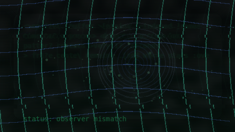

# PyReeler

PyReeler is a portable OpenAI Codex skill for designing and delivering short code-generated films, loops, and experimental motion pieces.

It is intentionally skill-first rather than framework-first. The portable package is meant to stay lightweight, readable, and dependable across common modern hardware.

It is built around a simple rule set:
- make a full-duration preview first
- keep previews cheap by lowering fidelity before lowering runtime
- judge the piece on arc, motif development, pacing, and landing
- only upscale after preview approval

## Contents

- `SKILL.md`: core skill instructions
- `references/`: workflow and creative references
- `references/audio-pipeline.md`: code-first guidance for procedural sound, stem design, mixing, and FFmpeg handoff
- `templates/`: lightweight starter modules for reusable audio structure
- `agents/openai.yaml`: UI metadata for skill lists and chips
- `examples/`: sample output media for the repository page

## Usage

Install the skill into your Codex skills directory and invoke it with `$pyreeler`.

Example prompt:

```text
Use $pyreeler to make a 45 second code-generated ritual film that begins calm, becomes entrancing, and ends with a single rupture.
```

## Audio Direction

PyReeler now treats audio as a first-class part of the film structure.

- Default audio direction: procedural foley and ambience
- Optional music layer: compact SoundFont workflow
- Optional voice layer: `edge-tts`
- Preferred structure: `ambience`, `pulse`, `impacts`, `score`, and `voice` as separate conceptual stems

The goal is not to turn the skill into a large audio engine. The goal is to give future sessions a small, reusable audio backbone that still feels code-first and portable.

## Template Layer

The `templates/audio/` folder provides lightweight starters, not a full framework.

- `sfx_gen.py`: procedural ambience, impacts, and shimmer
- `composer.py`: motif-to-MIDI helpers and optional SoundFont rendering path
- `voice.py`: optional `edge-tts` helper
- `audio_engine.py`: simple stem placement, ducking, mastering, and WAV export

These templates are intended to reduce reinvention across sessions while keeping the main film script focused on timing, motif, and scene structure.

The `templates/video/` folder provides lightweight runtime helpers for portable FFmpeg decisions.

- `ffmpeg_utils.py`: host-profile detection, encoder smoke tests, and conservative worker heuristics
- `render_runtime.py`: one-call portable render defaults for encoder, ffmpeg path, and worker count

## Dependency Approach

PyReeler uses a tiered dependency model.

- Core path: keep things working with small, common tools such as `ffmpeg`, `numpy`, and standard Python
- Recommended procedural audio path: add `scipy` when filtering materially improves the result
- Optional score path: add `midiutil` and `fluidsynth` or `pyfluidsynth`, plus a small SoundFont such as `TimGM6mb.sf2`
- Optional voice path: add `edge-tts` only when the piece actually needs voice

This keeps the portable skill useful on modest machines while still allowing richer local workflows.

## Workflow Notes

- `Preview` means a full-duration piece for artistic review.
- `Test pass` means a technical or debugging render and should not be shown as the preview.
- If the chosen renderer cannot actually support the planned brief fields or behaviors, patch the implementation or narrow the brief before rendering.
- Prefer scripting deterministic work such as validation, render orchestration, sampling, and cleanup when it improves efficiency without reducing quality.

## Portability Policy

The portable `pyreeler` package should stay conservative.

- Prefer hardware-aware defaults over machine-specific hardcoding
- Validate hardware encoders before assuming they work
- Keep fallbacks reliable, especially `libx264`
- Avoid requiring heavy dependencies for the default path

For typical modern installs, PyReeler should automatically help without requiring the user to know encoder names.

- Probe the host with standard-library tools first
- Prefer a validated hardware encoder when one actually works
- Fall back cleanly to `libx264`
- Use a conservative worker cap so preview renders stay responsive on shared CPU/GPU systems

Local installed copies can be more aggressive and more optimized.

- local installs may use stronger hardware overrides
- local installs may add machine-specific dependencies
- local installs may experiment with more opinionated render or audio helpers

In short: the mobile skill should travel well, and local installs can be tuned harder.

## Modern Hardware Defaults

PyReeler now has a portable path for common modern hardware profiles:

- NVIDIA: prefer `h264_nvenc` after validation
- Apple Silicon: prefer `h264_videotoolbox` after validation
- Intel graphics / Quick Sync: prefer `h264_qsv` after validation
- AMD graphics: prefer `h264_amf` after validation
- Unknown or unsupported environments: fall back to `libx264`

The same portable path should also choose a conservative default worker count for CPU-bound frame generation instead of assuming single-process rendering forever.

## Benchmark Note

A lightweight 30-second narrative preview benchmark on this machine showed:

- `cpu`: `libx264`, 1 worker, about `5.9s`
- `gpu`: validated `h264_nvenc`, 1 worker, about `6.0s`
- `gpu_multi`: validated `h264_nvenc`, 4 workers, about `3.8s`

The practical takeaway is:

- hardware encoding alone may not help much when frame synthesis is CPU-bound
- portable multicore frame generation can materially reduce preview time
- the portable package should favor automatic safe defaults rather than asking casual users to tune encoder names or worker counts manually

## Example Output

[](examples/horizon-maintenance-log.mp4)

Example film:
- `examples/horizon-maintenance-log.mp4`

## GitHub Media Notes

GitHub supports images in Markdown and supports uploaded media files including `.mp4`, `.mov`, and `.webm`, but browser and codec behavior can still vary.

For a repository `README`, the safest presentation is still an image or GIF that links to an MP4 in the repo, or to an external host such as YouTube or Vimeo.

## Also Available For

PyReeler is also available as a Claude Code skill. See the companion package.

## Publishing Notes

- This portable package is licensed under `MIT`. See `LICENSE`.
- If you adapt or redistribute PyReeler, please preserve the original copyright and license notice.
- If the skill name changes, update `SKILL.md`, `agents/openai.yaml`, and the enclosing folder name together.
